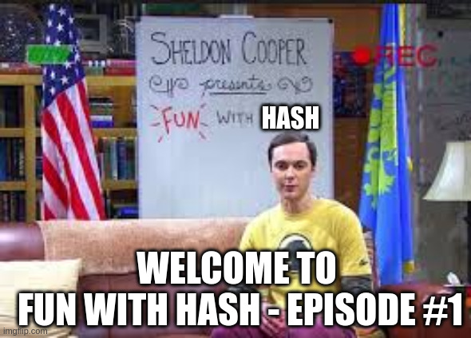

# FCSC 2025 Fun with Hash

Auteurs : graniter / Cryptanalyse

Origine : [Fun with Hash](https://hackropole.fr/fr/challenges/crypto/fcsc2025-crypto-fun-with-hash/)

## Challenge
[files/fun-with-hash.py](files/fun-with-hash.py)

-----------

## Installation manuel
Vous n'utilisez pas l'application **les CTFs de Cyrhades** ? C'est dommage !
Mais voici comment installer ce CTF manuellement :

> git clone https://github.com/Hack-Oeil/fcsc2025-crypto-fun-with-hash.git

> cd fcsc2025-crypto-fun-with-hash

> docker compose up

-----------

## Sur le site officiel hackropole.fr
> https://hackropole.fr/fr/challenges/crypto/fcsc2025-crypto-fun-with-hash/
